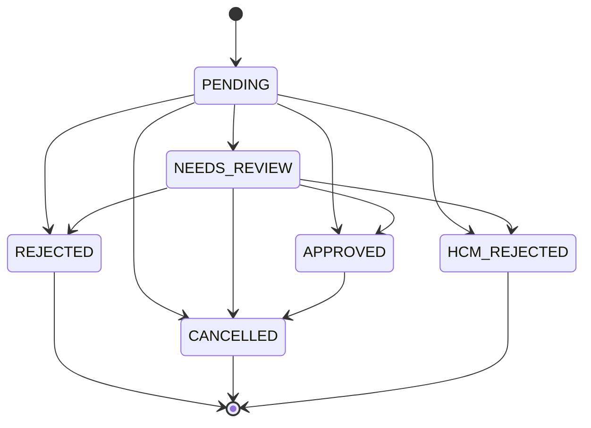
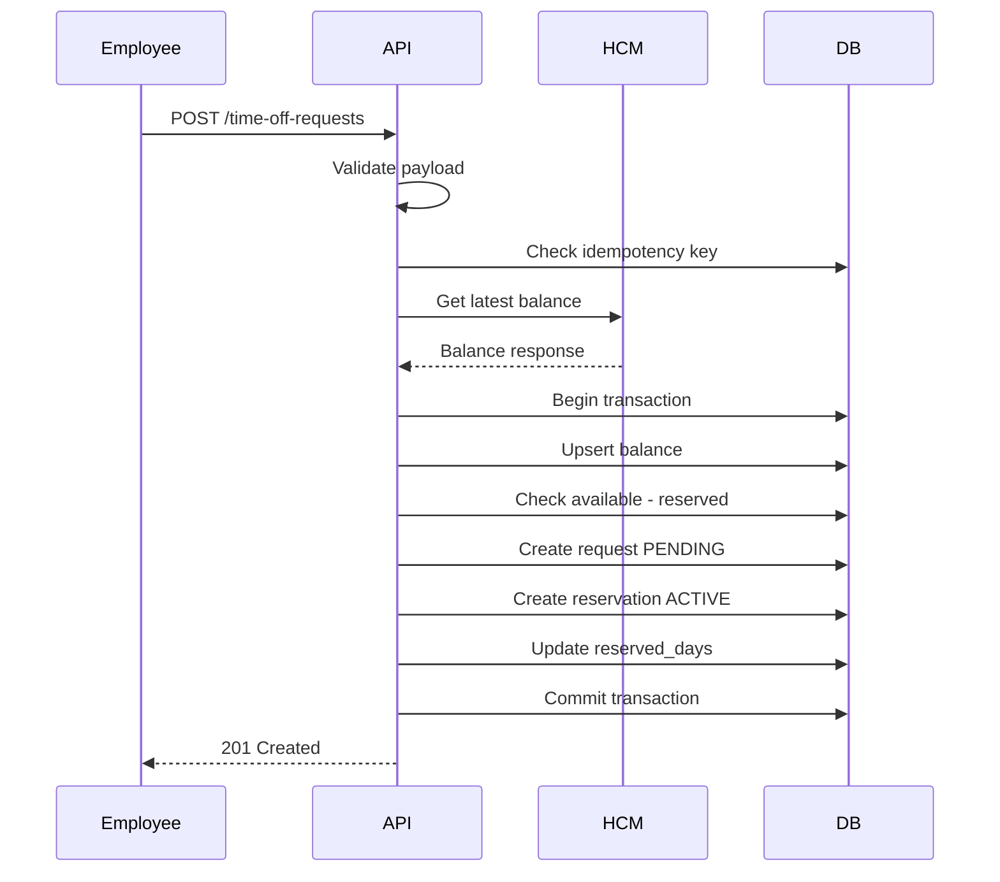
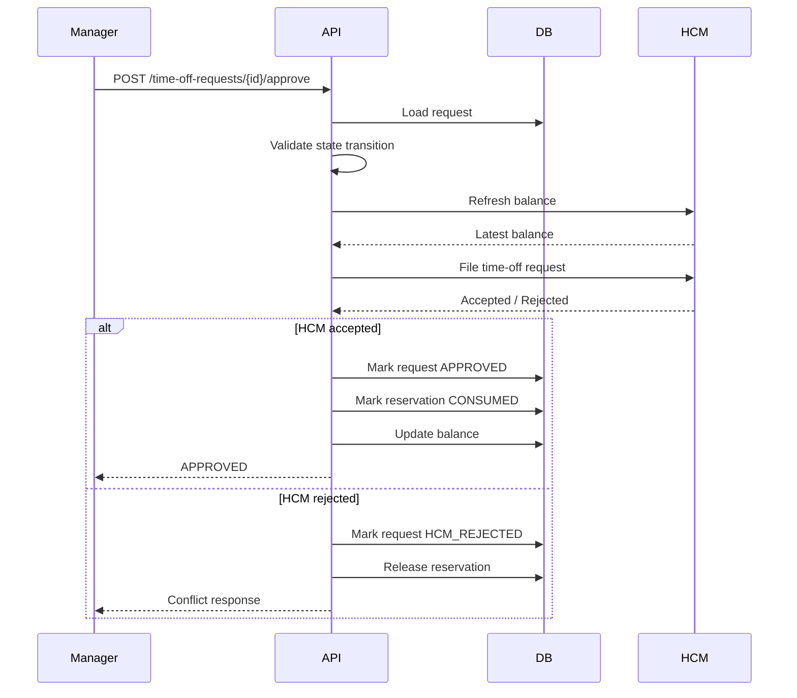

# Technical Requirements Document — Time-Off Microservice

| Field | Value |
|--------|--------|
| **Project** | Time-Off Microservice for ReadyOn |
| **Candidate** | Abdul Wahab |
| **Target role** | Fresh Graduate / Junior Fullstack Engineer, AI-First |
| **Primary stack** | NestJS, SQLite, JavaScript |
| **Document type** | Technical Requirements Document |
| **Version** | 1.0 |
| **Status** | Proposed implementation design |

---

## 1. Executive summary

ReadyOn provides an employee-facing interface for requesting time off. However, the Human Capital Management system, such as Workday, SAP, or a similar platform, remains the authoritative source of truth for employment and time-off balance data.

The main engineering challenge is maintaining balance integrity between ReadyOn and the HCM while supporting a responsive user experience.

This microservice is responsible for:

- Managing the lifecycle of employee time-off requests.
- Maintaining a local operational view of HCM balances.
- Preventing local overbooking through reservations.
- Validating critical decisions against HCM.
- Supporting real-time HCM balance checks.
- Supporting HCM batch synchronization.
- Handling HCM failures and inconsistencies defensively.
- Providing a rigorous automated test suite that proves the system behaves safely under normal and failure scenarios.

The system is intentionally designed as a pragmatic take-home implementation, while still reflecting production-grade architectural thinking around consistency, idempotency, auditability, failure handling, and testability.

---

## 2. Problem statement

ReadyOn is not the only system that can affect an employee’s time-off balance.

For example:

- HCM may refresh balances at the start of the year.
- Employees may receive additional leave on work anniversaries.
- HR administrators may manually adjust balances.
- Other integrated systems may file time-off directly against HCM.
- HCM may reject ReadyOn requests due to insufficient balance or invalid dimensions.
- HCM errors may not always be perfectly reliable, so ReadyOn must also validate defensively.

Therefore, ReadyOn cannot simply store a balance locally and assume it is always correct.

The core problem is:

**Build a backend service that allows employees to request time off while keeping ReadyOn’s local state consistent enough for workflow decisions and always treating HCM as the final authority for approved balance changes.**

---

## 3. Goals

The service should achieve the following goals:

- Employees can view their current known time-off balance.
- Employees can create time-off requests.
- Managers can approve or reject time-off requests.
- ReadyOn maintains local balance reservations for pending requests.
- ReadyOn checks HCM before creating or approving requests.
- ReadyOn supports batch balance synchronization from HCM.
- ReadyOn detects when pending requests become risky after HCM balance changes.
- ReadyOn prevents duplicate requests through idempotency.
- ReadyOn records important events for auditability.
- The system includes a strong test suite covering happy paths, edge cases, HCM failures, sync conflicts, and concurrency-sensitive behavior.

---

## 4. Non-goals

The following are intentionally out of scope for this take-home version:

- Full frontend application.
- Production authentication provider integration.
- Real Workday, SAP, or third-party HCM integration.
- Complex leave policies by country, department, or employee type.
- Half-day or hourly leave calculations.
- Holiday calendars and weekend exclusion.
- Multiple leave categories such as sick leave, casual leave, and unpaid leave.
- Payroll integration.
- Distributed message queues.
- Multi-region deployment.
- Real observability infrastructure such as Prometheus, Datadog, or OpenTelemetry collectors.

These are valuable production concerns, but including all of them would make the assignment unnecessarily large. The design leaves clear extension points for these future improvements.

---

## 5. Key product assumptions

The implementation assumes the following:

- Balances are tracked per employee and per location.
- **Balance key** = `employeeId` + `locationId`.
- HCM is the source of truth for actual available balance.
- ReadyOn stores a local operational copy of the balance.
- Pending ReadyOn requests reserve balance locally.
- Approved requests must be submitted to HCM.
- HCM may update balances independently of ReadyOn.
- HCM provides:
  - A real-time balance lookup API.
  - A real-time time-off filing API.
  - A batch balance sync endpoint or payload.
- HCM may return errors for:
  - Invalid employee/location combinations.
  - Insufficient balance.
  - Unavailable service.
  - Unexpected internal errors.
- SQLite is used for this project to keep setup simple.
- The implementation will use JavaScript to comply with the submission instruction, while following NestJS architectural conventions.
- **Overlapping date ranges:** the service blocks creating a new request only when it would overlap another request in **`PENDING`** or **`NEEDS_REVIEW`** for the same employee and location. Overlapping an **`APPROVED`** request is allowed (HCM is authoritative for filed leave; this scope matches the take-home workflow and avoids double-counting only for in-flight local reservations).
- **Batch sync conflict escalation:** when `reservedDays > hcmAvailableDays` after a batch upsert, only requests in **`PENDING`** are transitioned to **`NEEDS_REVIEW`**. Rows already in **`NEEDS_REVIEW`** are not updated again by the same rule (they already require manual handling).

---

## 6. Architectural principle

The most important architectural principle is:

**HCM is authoritative. ReadyOn is a workflow coordinator with a defensive local cache.**

This means:

- ReadyOn can cache HCM balances for performance.
- ReadyOn can reserve local balance to avoid duplicate pending requests.
- ReadyOn should not mark a request as approved unless HCM accepts it.
- ReadyOn should treat HCM batch updates as authoritative snapshots.
- ReadyOn should fail safely when HCM cannot confirm a critical operation.
- ReadyOn should never silently ignore balance conflicts.

---

## 7. Domain model

The service has the following core domain concepts.

### 7.1 Employee

An employee is identified by `employeeId`.

For this assignment, employee records do not need to be fully modeled. The system treats `employeeId` as an external identifier owned by HCM.

### 7.2 Location

A location is identified by `locationId`.

Balances are scoped by employee and location.

**Example:**

- `employeeId = emp_123`, `locationId = loc_pk` — this combination may have a different balance from `employeeId = emp_123`, `locationId = loc_us`.

### 7.3 Balance

A balance represents ReadyOn’s latest known HCM balance for a specific employee/location pair.

It includes:

- `hcmAvailableDays`
- `reservedDays`
- `lastSyncedAt`
- `syncSource`

The user-facing safe balance is:

`displayAvailableDays = hcmAvailableDays - reservedDays`

For API presentation, negative display balance should be returned as `0`, while the internal conflict should still be recorded.

### 7.4 Reservation

A reservation represents days locally held for a pending request.

Reservations prevent this situation:

- Employee has 10 days.
- Employee submits Request A for 7 days.
- Employee submits Request B for 7 days before manager approval.

Without reservations, both could appear valid. With reservations:

- Request A reserves 7 days.
- Remaining display balance becomes 3 days.
- Request B is rejected locally before approval.

### 7.5 Time-off request

A time-off request represents the employee’s request to take leave for a date range.

It moves through a controlled state machine:

`PENDING`, `APPROVED`, `REJECTED`, `CANCELLED`, `HCM_REJECTED`, `NEEDS_REVIEW`

**Outbound failures vs request row:** `time_off_requests.status` does **not** use a terminal **`FAILED`** state. Classification of HCM-facing failures is recorded on **`hcm_operations`** (`SUCCESS`, `FAILED`, `RETRYABLE_FAILED`). If approval hits an **unexpected** error after an operation row is started, the operation is marked **`FAILED`**, the request typically **remains `PENDING`**, and the client may receive **`500`** so operators can reconcile or retry safely. A dedicated request-level `FAILED` status remains a **future extension** if product wants a visible terminal state for non-HCM bugs.

### 7.6 HCM operation

An HCM operation represents an outbound interaction with HCM.

This is useful for:

- Idempotency.
- Debugging.
- Preventing duplicate external submissions.
- Recording failed external calls.
- Supporting future retry/outbox behavior.

---

## 8. High-level architecture

```
                 ┌──────────────────────┐
                 │      API Client       │
                 │ Employee / Manager    │
                 └──────────┬───────────┘
                            │
                            ▼
                 ┌──────────────────────┐
                 │     NestJS API        │
                 │ Controllers + DTOs    │
                 └──────────┬───────────┘
                            │
          ┌─────────────────┼─────────────────┐
          ▼                 ▼                 ▼
┌─────────────────┐ ┌─────────────────┐ ┌─────────────────┐
│ Time-Off Domain │ │ Balance Domain   │ │ Sync Domain      │
│ Service         │ │ Service          │ │ Service          │
└────────┬────────┘ └────────┬────────┘ └────────┬────────┘
         │                   │                   │
         ▼                   ▼                   ▼
┌──────────────────────────────────────────────────────────┐
│                    SQLite Database                       │
│ requests, balances, reservations, hcm_operations, audits │
└──────────────────────────────────────────────────────────┘
                            │
                            ▼
                 ┌──────────────────────┐
                 │     HCM Client        │
                 │ Real or Mock HCM API  │
                 └──────────────────────┘
```

---

## 9. NestJS modules (as implemented in this repository)

SQL migrations live at **`migrations/`** (repo root), not under `src/`. Cross-cutting HTTP concerns use **`common/errors`**, **`common/filters`**, **`common/guards`**, **`common/middleware`**, and **`common/utils`** (DTO validation for HTTP bodies uses `class-validator` in feature modules rather than a separate `common/validation` tree).

```
time-off-microservice/
├── migrations/
├── scripts/
├── test/
├── src/
│   ├── app.module.js
│   ├── main.js
│   ├── configure-app.js
│   ├── health/
│   │   ├── health.module.js
│   │   └── health.controller.js
│   ├── balances/
│   │   ├── balances.module.js
│   │   ├── balances.controller.js
│   │   ├── balances.service.js
│   │   └── balances.repository.js
│   ├── time-off-requests/
│   │   ├── dto/
│   │   ├── time-off-requests.module.js
│   │   ├── time-off-requests.controller.js
│   │   ├── time-off-requests.service.js
│   │   ├── time-off-requests.repository.js
│   │   ├── reservations.repository.js
│   │   ├── hcm-operations.repository.js
│   │   └── time-off-state-machine.js
│   ├── hcm/
│   │   ├── hcm.module.js
│   │   ├── hcm-client.service.js
│   │   ├── hcm-error.mapper.js
│   │   ├── hcm.types.js
│   │   ├── mock-hcm.service.js
│   │   └── mock-hcm.controller.js
│   ├── sync/
│   │   ├── sync.module.js
│   │   ├── sync.controller.js
│   │   ├── sync.service.js
│   │   └── sync.repository.js
│   ├── audit/
│   │   ├── audit.module.js
│   │   ├── audit.service.js
│   │   └── audit.repository.js
│   ├── database/
│   │   ├── database.module.js
│   │   ├── database.constants.js
│   │   └── sqlite.client.js
│   └── common/
│       ├── common.module.js
│       ├── errors/
│       ├── filters/
│       ├── guards/
│       ├── middleware/
│       └── utils/
```

---

## 10. Data model

SQLite will be used for persistence.

The design uses a combination of current state tables and audit/history tables. This provides simplicity for the assignment while still showing production-aware design.

### 10.1 `balances`

Stores the latest known HCM balance for each employee/location pair.

```sql
CREATE TABLE balances (
  id TEXT PRIMARY KEY,
  employee_id TEXT NOT NULL,
  location_id TEXT NOT NULL,
  hcm_available_days INTEGER NOT NULL,
  reserved_days INTEGER NOT NULL DEFAULT 0,
  last_synced_at TEXT,
  sync_source TEXT NOT NULL,
  version INTEGER NOT NULL DEFAULT 1,
  created_at TEXT NOT NULL,
  updated_at TEXT NOT NULL,

  UNIQUE(employee_id, location_id),
  CHECK(hcm_available_days >= 0),
  CHECK(reserved_days >= 0)
);
```

**Notes:**

- `hcm_available_days` is the latest known HCM value.
- `reserved_days` is controlled by ReadyOn.
- `version` supports optimistic concurrency if needed later.
- The unique constraint prevents duplicate balance records for the same employee/location pair.

### 10.2 `time_off_requests`

Stores time-off request lifecycle data.

```sql
CREATE TABLE time_off_requests (
  id TEXT PRIMARY KEY,
  employee_id TEXT NOT NULL,
  location_id TEXT NOT NULL,
  start_date TEXT NOT NULL,
  end_date TEXT NOT NULL,
  requested_days INTEGER NOT NULL,
  reason TEXT,
  status TEXT NOT NULL,
  manager_id TEXT,
  hcm_transaction_id TEXT,
  idempotency_key TEXT,
  failure_code TEXT,
  failure_reason TEXT,
  created_at TEXT NOT NULL,
  updated_at TEXT NOT NULL,

  CHECK(requested_days > 0)
);
```

**Recommended indexes:**

```sql
CREATE INDEX idx_time_off_employee ON time_off_requests(employee_id);
CREATE INDEX idx_time_off_status ON time_off_requests(status);
CREATE INDEX idx_time_off_location ON time_off_requests(location_id);
CREATE UNIQUE INDEX idx_time_off_idempotency
ON time_off_requests(employee_id, idempotency_key)
WHERE idempotency_key IS NOT NULL;
```

### 10.3 `balance_reservations`

Stores reservations separately instead of relying only on `reserved_days`.

This gives better traceability and allows reconciliation.

```sql
CREATE TABLE balance_reservations (
  id TEXT PRIMARY KEY,
  request_id TEXT NOT NULL,
  employee_id TEXT NOT NULL,
  location_id TEXT NOT NULL,
  reserved_days INTEGER NOT NULL,
  status TEXT NOT NULL,
  created_at TEXT NOT NULL,
  released_at TEXT,

  UNIQUE(request_id),
  CHECK(reserved_days > 0),

  FOREIGN KEY(request_id) REFERENCES time_off_requests(id)
);
```

**Reservation statuses:** `ACTIVE`, `RELEASED`, `CONSUMED`

| Status | Meaning |
|--------|---------|
| `ACTIVE` | Balance is currently reserved for a pending request |
| `RELEASED` | Reservation was released because request was rejected, cancelled, or failed |
| `CONSUMED` | Reservation was consumed because request was approved by HCM |

The `balances.reserved_days` field can be maintained as a denormalized value for fast reads, while `balance_reservations` provides detailed traceability.

### 10.4 `hcm_operations`

Tracks external HCM interactions.

```sql
CREATE TABLE hcm_operations (
  id TEXT PRIMARY KEY,
  request_id TEXT,
  operation_type TEXT NOT NULL,
  idempotency_key TEXT NOT NULL,
  status TEXT NOT NULL,
  hcm_transaction_id TEXT,
  request_payload TEXT,
  response_payload TEXT,
  error_code TEXT,
  error_message TEXT,
  created_at TEXT NOT NULL,
  completed_at TEXT,

  UNIQUE(idempotency_key)
);
```

**Operation types:** `GET_BALANCE`, `FILE_TIME_OFF`, `CANCEL_TIME_OFF`, `BATCH_SYNC`

**Statuses:** `STARTED`, `SUCCESS`, `FAILED`, `RETRYABLE_FAILED`

This table is a simplified version of the outbox/audit pattern. In a production system, it could evolve into a durable retry mechanism.

### 10.5 `hcm_sync_runs`

Tracks batch sync jobs.

```sql
CREATE TABLE hcm_sync_runs (
  id TEXT PRIMARY KEY,
  sync_type TEXT NOT NULL,
  status TEXT NOT NULL,
  snapshot_at TEXT,
  records_received INTEGER NOT NULL DEFAULT 0,
  records_processed INTEGER NOT NULL DEFAULT 0,
  records_failed INTEGER NOT NULL DEFAULT 0,
  error_summary TEXT,
  started_at TEXT NOT NULL,
  completed_at TEXT
);
```

### 10.6 `audit_logs`

Stores important business events.

```sql
CREATE TABLE audit_logs (
  id TEXT PRIMARY KEY,
  entity_type TEXT NOT NULL,
  entity_id TEXT NOT NULL,
  action TEXT NOT NULL,
  metadata TEXT,
  created_at TEXT NOT NULL
);
```

**Examples of audit actions:** `REQUEST_CREATED`, `REQUEST_APPROVED`, `REQUEST_REJECTED`, `REQUEST_CANCELLED`, `BALANCE_REFRESHED`, `BALANCE_RESERVED`, `RESERVATION_RELEASED`, `HCM_REJECTED_REQUEST`, `REQUEST_MARKED_NEEDS_REVIEW`, `BATCH_SYNC_COMPLETED`

---

## 11. Core system invariants

The system must preserve the following invariants.

| Invariant | Statement |
|-----------|-----------|
| **1** | A request cannot become `APPROVED` unless HCM accepts the time-off filing. |
| **2** | `reservedDays >= 0` |
| **3** | `displayAvailableDays = hcmAvailableDays - activeReservedDays` (local display must not ignore reservations). |
| **4** | The same `employeeId` + `idempotencyKey` must return the existing request (no duplicate reservations). |
| **5** | A batch balance update may update `hcmAvailableDays`, but it must not blindly delete pending ReadyOn reservations. |
| **6** | If HCM balance becomes lower than locally reserved days, affected **`PENDING`** requests must be flagged as `NEEDS_REVIEW` (see §5 batch sync note). |
| **7** | Every business-critical state transition must be auditable. |

---

## 12. Time-off request state machine

### 12.1 Status definitions

| Status | Meaning |
|--------|---------|
| `PENDING` | Request was created and balance is reserved locally |
| `APPROVED` | HCM accepted the request and manager approval completed |
| `REJECTED` | Manager rejected the request |
| `CANCELLED` | Employee or manager cancelled the request |
| `HCM_REJECTED` | HCM rejected the request during validation or approval |
| `NEEDS_REVIEW` | HCM balance changed and request may no longer be safe |

### 12.2 Allowed transitions

- `PENDING` → `APPROVED`, `REJECTED`, `CANCELLED`, `HCM_REJECTED`, `NEEDS_REVIEW`
- `NEEDS_REVIEW` → `APPROVED`, `REJECTED`, `CANCELLED`, `HCM_REJECTED`
- `APPROVED` → `CANCELLED`

**Invalid examples:** `REJECTED` → `APPROVED`, `CANCELLED` → `APPROVED`, `HCM_REJECTED` → `APPROVED`, `APPROVED` → `REJECTED`

### 12.3 State machine diagram



### 12.4 Approval errors and `hcm_operations`

- **Insufficient balance / invalid dimensions** from HCM during file: request moves to **`HCM_REJECTED`**, reservation **`RELEASED`**, operation row **`FAILED`** with a domain error code; API returns **`409`** or **`422`** as appropriate.
- **Retryable HCM errors** (e.g. timeout): operation row **`RETRYABLE_FAILED`**, request stays **`PENDING`**, API **`503`** — manager can retry approval later.
- **Unexpected errors** (e.g. non-`HttpException`): operation row **`FAILED`**, request stays **`PENDING`**, API **`500`** — no silent approval; see §7.5.

---

## 13. Main workflows

### 13.1 Create time-off request

**Objective:** Allow an employee to create a pending time-off request while reserving local balance safely.

**Flow**

1. Receive request.
2. Validate input.
3. Check idempotency key.
4. Fetch latest balance from HCM.
5. Upsert local balance.
6. Start database transaction.
7. Recalculate local display balance.
8. If insufficient balance, reject request.
9. Create time-off request with `PENDING` status.
10. Create `ACTIVE` reservation.
11. Increment `balances.reserved_days`.
12. Commit transaction.
13. Write audit event.
14. Return created request.



**Important design decision:** HCM is called before creating the request because the local balance may be stale. If HCM is unavailable, the system fails safely and does not create a new request based on stale balance. If the client repeats the same `idempotencyKey`, the API returns **`200 OK`** with the existing request instead of **`201`** (§14.3).

### 13.2 Approve time-off request

**Objective:** Allow a manager to approve a request only if HCM accepts the final time-off filing.

**Flow**

1. Receive approval request.
2. Validate `managerId`.
3. Load request.
4. Ensure request is `PENDING` or `NEEDS_REVIEW`.
5. Fetch latest HCM balance.
6. Check HCM balance defensively.
7. Create HCM operation record with idempotency key.
8. Submit time-off filing to HCM.
9. If HCM accepts: mark request `APPROVED`, store `hcmTransactionId`, mark reservation `CONSUMED`, adjust local balance / `reservedDays`, write audit.
10. If HCM rejects: mark request `HCM_REJECTED` or `NEEDS_REVIEW`, release reservation when appropriate, write audit.
11. Return final request status.



**Important engineering note:** The system should avoid holding a database transaction open while calling HCM. Use local state checks before the call, an `hcm_operations` record for idempotency, call HCM with a stable idempotency key, then persist the final outcome after HCM responds (simplified saga-style workflow).

### 13.3 Reject time-off request

**Objective:** Allow a manager to reject a pending request and release reserved balance.

**Flow:** Validate → load → ensure `PENDING` or `NEEDS_REVIEW` → transaction: mark `REJECTED`, reservation `RELEASED`, decrement `reserved_days` → commit → audit → return.

### 13.4 Cancel time-off request

**Objective:** Allow cancellation of a pending or approved request.

- **Pending (`PENDING` / `NEEDS_REVIEW`):** mark `CANCELLED`, release reservation, decrease `reservedDays`.
- **Approved:** call HCM cancellation; on success mark `CANCELLED` and refresh balance; on failure keep `APPROVED` and return conflict.

For the take-home implementation, approved cancellation may be simplified, but the intended production behavior should be documented.

### 13.5 Batch balance sync

**Objective:** Update ReadyOn’s local balance cache using a full or partial balance snapshot from HCM.

**Flow:** Receive payload → create sync run → validate records → upsert `hcmAvailableDays` → preserve `reservedDays` → detect conflicts → if `reservedDays > hcmAvailableDays`, load **`PENDING`** requests for that employee/location and set each to **`NEEDS_REVIEW`** (requests already in **`NEEDS_REVIEW`** are unchanged) → complete sync run → return summary.

**Example**

Before sync: `hcmAvailableDays = 10`, `reservedDays = 6`, display = 4.  
HCM batch says: `hcmAvailableDays = 4`.  
After sync: internal display may be negative; API shows `0`; affected requests → `NEEDS_REVIEW`.

---

## 14. API design

The service will expose REST APIs. Standard error envelope: `{ "error": { "code", "message", "details" } }`.

### 14.1 Health check

`GET /health`

```json
{
  "status": "ok",
  "service": "time-off-microservice"
}
```

### 14.2 Get balance

`GET /balances/:employeeId/:locationId`  
Optional: `?refresh=true`

If `refresh=true`, call HCM before responding. If HCM fails during refresh, return cached balance with stale warning where appropriate.

```json
{
  "employeeId": "emp_123",
  "locationId": "loc_pk",
  "hcmAvailableDays": 10,
  "reservedDays": 2,
  "displayAvailableDays": 8,
  "isStale": false,
  "lastSyncedAt": "2026-04-24T10:00:00.000Z",
  "syncSource": "REALTIME"
}
```

| HTTP | Meaning |
|------|---------|
| 404 | Balance not found |
| 422 | Invalid employee/location combination |
| 503 | HCM refresh failed and no cached balance exists |

### 14.3 Create time-off request

`POST /time-off-requests`

```json
{
  "employeeId": "emp_123",
  "locationId": "loc_pk",
  "startDate": "2026-05-01",
  "endDate": "2026-05-02",
  "requestedDays": 2,
  "reason": "Family event",
  "idempotencyKey": "emp_123-loc_pk-2026-05-01-2026-05-02"
}
```

- **First submission:** **`201 Created`** with the new request body (`PENDING`, reserved days as applicable).
- **Idempotent replay** (same `employeeId` + `idempotencyKey` as an existing row): **`200 OK`** with the **same response shape** as create; no second reservation and no increment of `reservedDays`.

| HTTP | Code | Meaning |
|------|------|---------|
| 400 | `VALIDATION_ERROR` | Invalid payload |
| 409 | `INSUFFICIENT_BALANCE` | Not enough balance |
| 409 | `DUPLICATE_ACTIVE_REQUEST` | Conflicting active request |
| 422 | `INVALID_DIMENSIONS` | HCM does not recognize employee/location |
| 503 | `HCM_UNAVAILABLE` | Cannot safely verify balance |

### 14.4 Get time-off request

`GET /time-off-requests/:id`

### 14.5 List time-off requests

`GET /time-off-requests` — filters: `employeeId`, `locationId`, `status`, `managerId`

### 14.6 Approve request

`POST /time-off-requests/:id/approve` — body: `{ "managerId": "manager_001" }`

### 14.7 Reject request

`POST /time-off-requests/:id/reject` — body: `{ "managerId": "manager_001", "reason": "Team coverage issue" }`

### 14.8 Cancel request

`POST /time-off-requests/:id/cancel` — body: `{ "cancelledBy": "emp_123", "reason": "Plans changed" }`

### 14.9 Batch balance sync

`POST /sync/hcm/balances`

```json
{
  "snapshotAt": "2026-04-24T10:00:00.000Z",
  "balances": [
    {
      "employeeId": "emp_123",
      "locationId": "loc_pk",
      "availableDays": 15
    },
    {
      "employeeId": "emp_456",
      "locationId": "loc_us",
      "availableDays": 8
    }
  ]
}
```

```json
{
  "syncRunId": "sync_001",
  "status": "SUCCESS",
  "recordsReceived": 2,
  "recordsProcessed": 2,
  "recordsFailed": 0,
  "requestsMarkedNeedsReview": 0
}
```

---

## 15. Mock HCM design

The mock HCM is part of the assessment implementation. It should simulate enough real behavior to test the integration boundary.

### 15.1 Responsibilities

Balance lookup, time-off filing, cancellation, manual balance mutation, batch balance export, failure mode simulation.

### 15.2 Mock HCM endpoints

- `GET /mock-hcm/balances/:employeeId/:locationId`
- `POST /mock-hcm/time-off` — body includes `employeeId`, `locationId`, `requestedDays`, `externalRequestId`, `idempotencyKey`
- `POST /mock-hcm/time-off/:transactionId/cancel`
- `POST /mock-hcm/balances` — seed/update balance
- `POST /mock-hcm/failure-mode` — `{ "enabled": true, "mode": "DOWN" }`

**Supported modes:** `DOWN`, `TIMEOUT`, `INVALID_DIMENSIONS`, `INSUFFICIENT_BALANCE`, `RANDOM_FAILURE`

---

## 16. Consistency model

- **Source of truth:** HCM for actual leave balance.
- **Local consistency:** Reservations, request lifecycle, approvals, audit logs, idempotency records.
- **Eventual consistency:** Local balance may temporarily differ from HCM; acceptable only if ReadyOn behaves defensively (no final approval without HCM confirmation, no silent conflict swallowing, no hiding negative internal workflow state).

---

## 17. Idempotency strategy

### 17.1 Request creation

Constraint: `UNIQUE(employee_id, idempotency_key)` where key present.  
First request creates request and reservation; repeat with same key returns original without double reservation.

### 17.2 HCM filing

Stable key example: `hcm-file-timeoff-{requestId}` (or equivalent) so retries do not double-charge HCM.

---

## 18. Concurrency strategy

Use SQLite transactions, re-read balance inside the transaction, update `reserved_days` atomically, enforce reservation consistency, use idempotency keys. In production, Postgres row-level locking is preferred.

---

## 19. Error handling strategy

### 19.1 Error response format

```json
{
  "error": {
    "code": "INSUFFICIENT_BALANCE",
    "message": "Employee does not have enough available balance for this request.",
    "details": {
      "employeeId": "emp_123",
      "locationId": "loc_pk",
      "requestedDays": 5,
      "availableDays": 3
    }
  }
}
```

### 19.2 Error categories

| Category | HTTP | Example |
|----------|------|---------|
| Validation | 400 | Invalid dates |
| Conflict | 409 | Insufficient balance |
| Invalid dimensions | 422 | Employee/location invalid |
| External dependency | 503 | HCM unavailable |
| Unexpected | 500 | Database failure |

### 19.3 HCM error mapping

Map insufficient balance and invalid dimensions to **`HCM_REJECTED`** on the request row and the appropriate HTTP codes (`409` / `422`). Map timeout / ambiguous HCM client failures during approve to **`503`** and keep the request **`PENDING`** with `hcm_operations.status = RETRYABLE_FAILED` where applicable. **Unexpected** errors during approve: keep request **`PENDING`**, set `hcm_operations.status = FAILED`, return **`500`** — do **not** add a `FAILED` value to `time_off_requests.status` in this implementation (see §7.5, §12.4).

---

## 20. Defensive design choices

- Do not trust local balance alone for create/approve.
- Do not trust HCM errors alone — validate locally (positive days, sufficient balance, valid state, known dimensions, idempotency).
- Do not approve on HCM uncertainty — return `503`, keep pending or mark `NEEDS_REVIEW` as designed.
- Do not hide conflicts after batch sync — mark `NEEDS_REVIEW`.

---

## 21. Security considerations

### 21.1 Authentication

Take-home may mock auth. Production: JWT/session, IdP, service-to-service auth for sync.

### 21.2 Authorization

Suggested roles: employee (own balance/requests/cancel pending), manager (approve/reject in scope), admin/system (sync, audits). Employees must not approve own requests.

### 21.3 Input validation

Required fields, date formats, `endDate >= startDate`, `requestedDays > 0`, reasonable string lengths, valid identifier formats.

### 21.4 Secrets

Use environment variables (`PORT`, `DATABASE_URL`, `HCM_BASE_URL`, `HCM_API_KEY`, `NODE_ENV`). Provide `.env.example`, never commit real `.env`.

### 21.5 Audit logging

Append-only audit logs for debugging, investigation, compliance, traceability.

---

## 22. Observability

- Structured logs for important events.
- Correlation ID per request (`X-Correlation-Id` or generated in middleware), included in logs.
- `GET /health`; optional future `GET /health/dependencies` (SQLite, HCM).

---

## 23. Testing strategy

The test suite should prove: happy paths, HCM failures, stale balances, reservations, state transitions, batch sync, idempotency, invalid input, concurrency-sensitive behavior.

### 23.1 Unit tests

Pure business logic: balance display rules, request validation, state machine transitions, reservation lifecycle.

### 23.2 Integration tests

Against Nest app, SQLite test DB, mock HCM — scenarios including create (sufficient/insufficient balance), approve success, HCM rejects approval, batch sync up/down, invalid dimensions, HCM down on create, idempotency, concurrent reservations, duplicate approve safety, audit presence.

### 23.3 Contract tests for HCM client

Map success, insufficient balance, invalid dimensions, timeout, unexpected responses.

### 23.4 End-to-end scenario

Seed mock balance → create → verify reservation → approve → verify HCM/local state → verify reservation consumed → verify audit trail.

### 23.5 Coverage target

Statements / branches / functions / lines: **80%+**. README should document `npm run test:cov` and example coverage summary.

---

## 24. Engineering trade-offs

Summarized: local cache + reservations vs always-on HCM; synchronous HCM approval vs async; SQLite vs Postgres (chosen: SQLite for assignment); REST vs GraphQL (chosen: REST); realistic mock HCM vs static stubs (chosen: realistic mock).

---

## 25. Production readiness considerations

Future: Postgres, row locks, durable outbox, retry workers, real authZ, multiple leave types, calendars, reconciliation jobs, metrics, tracing, alerts, admin UI for failed syncs and review queue.

---

## 26. Risks and mitigations

| Risk | Mitigation |
|------|------------|
| HCM unavailable | Fail safely, `503`, keep pending |
| Stale local balance | Refresh before create/approve |
| Duplicate submissions | Idempotency + unique constraints |
| Batch sync reduces balance | `NEEDS_REVIEW` |
| Duplicate HCM filing | Stable HCM idempotency key |
| SQLite concurrency | Transactions; document Postgres upgrade |
| Invalid dimensions | HCM validation + `422` |
| Poor test coverage | Unit, integration, contract, E2E |

---

## 27. README requirements

Overview, architecture summary, setup, env vars, DB setup, run service, tests, coverage, API examples, mock HCM behavior, limitations, future improvements. Example commands: `npm install`, `npm run db:migrate`, `npm run start:dev`, `npm test`, `npm run test:e2e`, `npm run test:cov`.

---

## 28. Expected deliverables

Zip / repo should include:

```
time-off-microservice/
├── src/
├── test/
├── migrations/
├── TRD.md
├── README.md
├── package.json
├── package-lock.json
├── .env.example
└── coverage-summary.txt or README coverage section
```

**Should not include:** `node_modules/`, `coverage/`, `dist/`, `.env`, `.DS_Store`

---

## 29. Evaluation alignment

This TRD aligns the implementation with assessment criteria: engineering specification (problem, architecture, data model, consistency, APIs, failures, alternatives), rigorous tests (balance integrity, HCM failures, sync conflicts, idempotency, lifecycle, reservations), and code quality (small services, clear modules, explicit errors, predictable states, simple schema, easy setup, readable tests, clear README).

---

## 30. Final summary

The Time-Off Microservice is a defensive workflow layer between ReadyOn and HCM: HCM remains source of truth; ReadyOn caches balances and reserves for pending work; approval requires HCM acceptance; batch sync updates HCM fields while preserving reservations; conflicts surface as `NEEDS_REVIEW`; idempotency protects creates and filings; audit logs and a realistic mock HCM support correctness and testability.

---

## Appendix A — This repository (implementation notes)

The following supplements the specification with how this codebase maps to it:

| Area | Location |
|------|----------|
| Schema | `migrations/001_initial.sql` |
| State machine | `src/time-off-requests/time-off-state-machine.js` |
| Domain orchestration | `src/time-off-requests/time-off-requests.service.js` |
| Mock HCM | `src/hcm/mock-hcm.service.js`, `src/hcm/mock-hcm.controller.js` |
| HCM client / errors | `src/hcm/hcm-client.service.js`, `src/hcm/hcm-error.mapper.js` |
| Batch sync | `src/sync/sync.service.js`, `src/sync/sync.repository.js` |
| App wiring | `src/app.module.js`, `src/configure-app.js` |
| Tests | `npm test`, `npm run test:e2e`, `npm run test:cov` |

**Optional API key (assessment hardening):** When `API_KEY` is set, `ApiKeyGuard` protects mutating time-off routes, `POST /sync/hcm/balances`, and `/mock-hcm/*`. See `SECURITY.md`. **In-process mock HCM** (same Nest app) is used for integration tests instead of a separate HTTP mock server.

**Status line:** Treat **Section 1–30** as the authoritative product/technical specification. **§9** matches this repository’s layout. Appendix A lists key file paths and optional **`API_KEY`** behavior.
